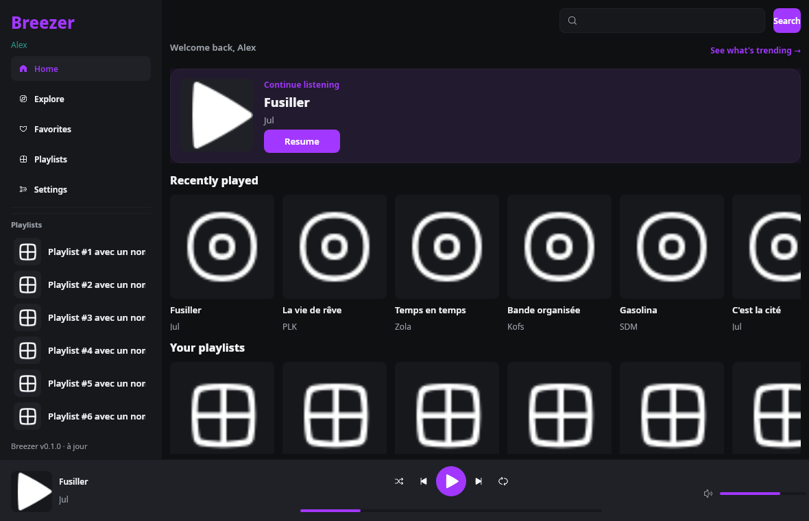
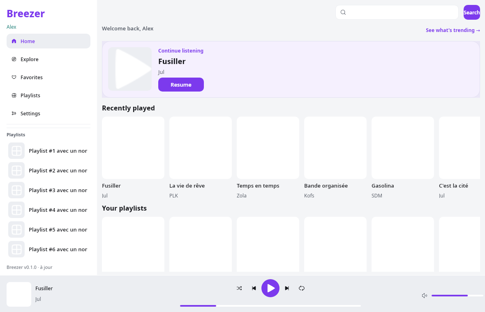
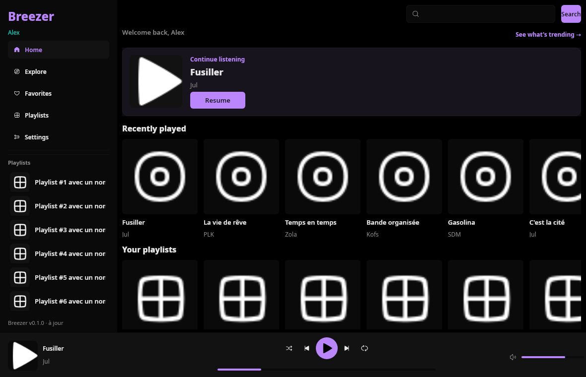
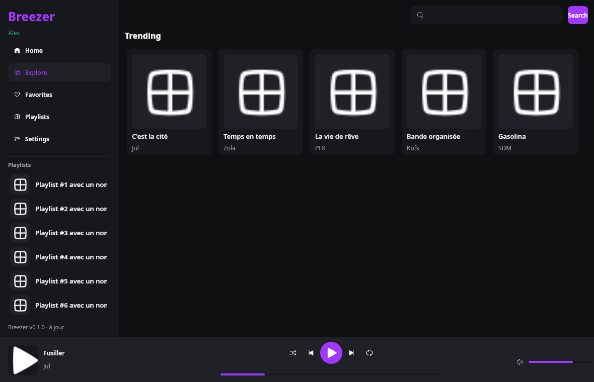

<p align="right">
🇫🇷 <b>Français</b> &nbsp;·&nbsp; <a href="README.md">🇬🇧 <b>English</b></a>
</p>

<div align="center">

# 🎧 Breezer

**Breezer — un client Deezer natif, léger et ultra-rapide, construit avec Rust.**

Linux · macOS · Windows


</div>

---

## ⚡ Léger, sérieusement

| | **Breezer** (Rust natif) | Applications musicales Electron typiques |
|---|---|---|
| **Mémoire** | **~75 Mo** RAM (mesuré, RSS sous Linux) | **300–600 Mo**+ |
| **Binaire** | ~40 Mo | 100 Mo+ de runtimes |
| **Lancement** | instantané | runtime lourd à démarrer |
| **Techno** | Rust + Slint, aucun navigateur embarqué | Chromium embarqué |

Pas d'Electron. Pas de navigateur embarqué. Juste un binaire natif qui streame votre musique et reste discret — chiffres RAM mesurés sous Linux x86_64.

## C'est quoi Breezer ?

Un lecteur musical **natif, petit et rapide** pour **Deezer** : recherche, streaming, navigation dans vos playlists et votre historique d'écoute, avec une interface propre et personnalisable. Il reprend le même flux d'authentification et de streaming que [tui-dzr](https://github.com/dunderdoo/tui-dzr) (ARL, déchiffrement Blowfish).

## 🧪 Plateformes testées

| Plateforme | Statut |
|---|---|
| 🐧 **Linux — Arch** (dev actuel) | ✅ Testé, utilisé tous les jours |
| 🐧 Linux — autres distros (Ubuntu, Fedora, Debian…) | 🕐 À tester |
| 🍎 macOS | 🕐 À tester |
| 🪟 Windows | 🕐 À tester |

> Toutes les plateformes sont compilées et packagées en CI (workflow Release vert sur Linux, macOS et Windows) ; **testé en conditions réelles pour l'instant sur Arch Linux.** Aidez-nous à cocher les autres cases !

## ✨ Fonctionnalités clés

- 🧊 **Léger** — binaire de quelques Mo, empreinte RAM réduite.
- 🎵 **Streaming réel** des pistes gratuites (auth ARL, déchiffrement isolé et auditable).
- 🏠 Pages façon Deezer : **Accueil** (reprendre la lecture, récemment écoutés), **Explorer** (tendances), **Coups de cœur**, **Playlists**.
- 🎨 **Système de thèmes** — sombre / clair / AMOLED intégrés, éditeur de couleurs, thèmes communautaires.
- 🧩 **Panneaux ancrables** — glisser-déposer, espaces de travail sauvegardés.
- 🌍 **i18n** — français & anglais (interface et messages).
- 🔍 **Zoom de l'interface** — `Ctrl +` / `Ctrl −` / `Ctrl 0` redimensionnent toute l'app, persistant.
- 🔄 **Auto-mise à jour** — vérifie, télécharge et se remplace automatiquement ; un clic pour redémarrer.
- 🔓 **AGPL-3.0** — un logiciel libre.

## 📸 Captures d'écran

| Sombre (défaut) | Clair | AMOLED |
|---|---|---|
| [](assets/screenshots/home-dark.png) | [](assets/screenshots/home-light.png) | [](assets/screenshots/home-amoled.png) |

[](assets/screenshots/explorer-dark.png)

## 🚀 Démarrage rapide

```bash
# Prérequis : Rust 1.85+, Linux : libasound2-dev libxkbcommon-dev cmake clang libfontconfig1-dev
cd software
cargo run --release
```

Au premier lancement : collez votre **cookie ARL** Deezer (voir [docs/ARL.md](docs/ARL.md), ~2 min) puis connectez-vous.

## 📦 Téléchargements

Les installateurs pré-compilés (AppImage/deb, dmg, nsis) sont publiés sur la page **[Releases](https://github.com/Stananas/Breezer/releases)**,
avec mises à jour automatiques.

- 🐧 **Arch Linux** (AUR, build depuis les sources) : `yay -S breezer`
- 🐧 **Linux portable** : `breezer_…_x86_64.AppImage` ou le binaire brut `breezer-linux-x86_64`
- 🍎 **macOS** : `Breezer_….dmg` &nbsp;·&nbsp; 🪟 **Windows** : installateur nsis

*Breezer se met à jour lui-même : il télécharge les nouvelles releases et remplace son propre binaire au lancement.*

## 🧱 Structure du dépôt

```
software/   # Client Rust (workspace Cargo : breezer + plugin-api)
site/       # Site web (Bun : Next.js + Elysia.js)
themes/     # Manifests de thèmes officiels & communautaires
docs/       # ARL, thèmes, plugins, captures d'écran
assets/     # Captures du README & éléments de marque
```

## 🛠 Développement

```bash
cargo check -p breezer        # vérification rapide
cargo run -p breezer          # lancer l'app (alias : cargo run)
cargo run -- --selftest       # autotest audio, sans GUI
cargo test -p breezer
```

Docs : [Thèmes](docs/THEMES.md) · [Plugins](docs/PLUGINS.md) · [Captures](docs/SCREENSHOTS.md) · [Contribuer](CONTRIBUTING.md)

## 🤝 Contribuer

Les contributions sont **très bienvenues** — signalements de bugs, fonctionnalités, thèmes, traductions, documentation, ou simplement retours.
Ouvrez une [issue](https://github.com/Stananas/Breezer/issues) ou une PR — voir [CONTRIBUTING.md](CONTRIBUTING.md)
pour le guide rapide (build, tests, conventions).

## ⚖️ Licence & aspects légaux

**AGPL-3.0-or-later.** Breezer est un client tiers indépendant, **non affilié** à Deezer SAS.
La lecture dépend des droits de votre compte Deezer ; le contenu protégé par DRM (Widevine) n'est jamais contourné.
Utilisez-le conformément aux Conditions Générales de Deezer et à votre législation locale.

---

**Fait avec ❤️ et Rust.** Contributions, thèmes et traductions bienvenues — la
[version anglaise de ce README](README.md) est disponible.